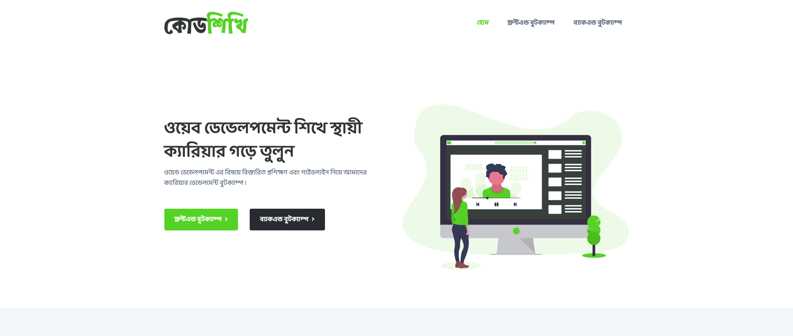

# [Templatecookie](https://templatecookie.com)
Templatecookie.com creates quality templates and php scripts. Templatecookie has many free HTML & Figma templates available for professional use. Templatecookie is famous for its premium PHP Scripts available on [Codeanyon Marketplace](https://codecanyon.net/user/templatecookie). Browse [Templatecookie](https://templatecookie.com) today and discover awesome digital products.

# [Codshikhi - eLearning HTML Template](https://www.templatecookie.com/products)

> Codeshikhi is an eLearning HTML Template with two courses and a course list on the landing page and also an instructor section has there. 

Check the [Live Demo here](https://codeshikhi-html.netlify.app/).

## Pages List
- Home (Landing Page)
- Course Details

## Framework & Technologies
- bootstrap
- jQuery
- scss
## Credits
- Design & Developed by [Templatecookie](https://templatecookie.com)

## License
The MIT License (MIT). Please see [License File](LICENSE.md) for more information.

